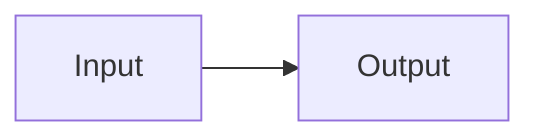

# slides

**Write Markdown. Present from the terminal.**

A developer-first presentation framework. Author slides in Markdown, serve them with hot reload, and present beautifully — no GUI needed.

## Quick Start

```bash
# 1. Create a new presentation
npx tsx src/cli.ts new my-talk.md

# 2. Edit my-talk.md in your favorite editor

# 3. Serve with hot reload
npx tsx src/cli.ts serve my-talk.md
```

## Features

- **Markdown slides** — separate slides with `---` dividers
- **Syntax-highlighted code** — powered by highlight.js, with line highlighting (`{2,4-6}`)
- **Executable code blocks** — `{exec}` runs JavaScript live like a REPL, with shared state across blocks
- **Animated exec blocks** — `{exec}` blocks receive an `output` element for async/animated updates with auto-cleanup
- **Live HTML/CSS/JS** — `{live}` renders interactive HTML directly in the slide DOM
- **Mermaid diagrams** — `mermaid` code blocks render as SVG diagrams
- **Incremental reveals** — `<!-- pause -->` shows content step by step
- **Speaker notes** — `<!-- Note text here -->` visible only to the presenter
- **3 themes** — `default`, `dark`, `retro` (cycle with `d`)
- **8-bit animated backgrounds** — pixel art scenes (`castle`, `northlights`, `dawn`, etc.)
- **Floating particles** — animated background particles per slide
- **Confetti** — celebration effect on any slide
- **Live audience sync** — `--live` mode with emoji reactions and real-time slide following
- **Public tunnels** — `--tunnel` creates a Cloudflare tunnel for remote audiences
- **AI slide generation** — generate presentations from a topic using Claude API
- **Vim-style keyboard shortcuts** — `h/j/k/l`, overview, fullscreen, timer

## CLI Reference

| Command | Description |
|---------|-------------|
| `slides serve [file]` | Start dev server with hot reload (default: `example.md`) |
| `slides new [file]` | Create a new presentation from template |
| `slides build [file]` | Build static site for deployment |
| `slides generate [topic]` | Generate a presentation with AI (requires `ANTHROPIC_API_KEY`) |
| `slides help` | Show help message |

**Flags:**

| Flag | Description |
|------|-------------|
| `--live` | Enable live sync (audience follows along) |
| `--tunnel` | Start a Cloudflare tunnel for public access (requires `cloudflared`) |
| `--output=file.md` | Output file for `generate` command (default: `generated.md`) |

Run commands via `npx tsx src/cli.ts <command>` or `npm run slides -- <command>`.

## Slide Format

### Global frontmatter

```markdown
---
title: My Presentation
theme: dark
---
```

### Slides

Separate slides with `---` on its own line:

```markdown
# First Slide

Content here

---

# Second Slide

More content
```

### Per-slide options

Add frontmatter between `---` lines before a slide:

```markdown
---
layout: center
bg: northlights
particles: true
confetti: true
---
```

| Option | Values |
|--------|--------|
| `layout` | `default`, `center`, `cover` (auto-detected if omitted) |
| `bg` | `castle`, `northlights`, `dawn`, `cherryblossom`, `falls`, `nature`, `bridge_raining`, `et`, `watchdogs`, `pixelphony_2`, image path, or CSS gradient |
| `particles` | `true` — floating animated particles |
| `confetti` | `true` — confetti celebration effect |

### Code blocks

````markdown
```python {2,4-6}
# Lines 2 and 4-6 are highlighted
```

```js {exec}
// Runs live in the browser like a REPL
console.log("Hello from the slide!")
```

```html {live}
<div style="color: red;">Rendered directly in the slide</div>
```


````

### Incremental reveals

```markdown
- First point appears

<!-- pause -->

- Then this one on next click
```

### Speaker notes

```markdown
Content visible to audience

<!-- Remember to demo this feature -->
```

## Keyboard Shortcuts

| Key | Action |
|-----|--------|
| `Right` / `Space` / `l` / `j` | Next slide / step |
| `Left` / `Backspace` / `h` / `k` | Previous slide / step |
| `g` / `Home` | First slide |
| `G` / `End` | Last slide |
| `f` | Toggle fullscreen |
| `o` | Toggle overview |
| `t` | Toggle timer |
| `d` | Cycle themes |
| `?` | Toggle help overlay |
| `Escape` | Close overlay |

## Development

```bash
# Start dev server with example slides
npm run dev

# Type-check
npx tsc -b

# Build for production
npm run build
```

### Project structure

```
src/
  cli.ts                    # CLI entry point (serve, new, build, generate)
  parser.ts                 # Markdown-to-slides parser, frontmatter, layout detection
  App.tsx                   # Main React app, state, keyboard/touch handlers
  main.tsx                  # React DOM entry point
  types.ts                  # TypeScript interfaces (Slide, SlidesMeta, SlidesData)
  vite-plugin-slides.ts     # Custom Vite plugin, virtual module, HMR, live sync
  components/
    SlideRenderer.tsx       # Core rendering: {exec}, {live}, mermaid, particles
    SlideOverview.tsx       # Overview grid mode
    HelpOverlay.tsx         # Keyboard shortcuts overlay
    Timer.tsx               # Presentation timer
    ProgressBar.tsx         # Slide progress indicator
    AudienceBar.tsx         # Live mode audience controls
    ReactionOverlay.tsx     # Emoji reactions display
  themes/
    base.css                # Shared base styles
    default.css             # Default theme
    dark.css                # Dark theme
    retro.css               # Retro 8-bit theme
```

## License

MIT
