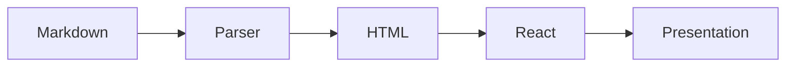

# slides

A developer-first presentation framework

**Write Markdown. Present from the terminal.**

```bash
slides serve deck.md
```

---

## Why slides?

- Write presentations in **Markdown** -- version control friendly
- Serve from the **terminal** -- no GUI needed
- **Hot reload** -- edit your .md file and see changes instantly
- **Multiple themes** -- default, dark, and retro (8-bit!)
- **Agent-friendly** -- LLMs can generate slide decks natively
- **Timer built in** -- track how long you've been presenting

---

## Incremental Reveal

Add pause comments between content to reveal step by step:

- First, this point appears

<!-- pause -->

- Then this one shows up on click

<!-- pause -->

- And finally this one!

<!-- This is a speaker note for the incremental reveal slide -->

---

## Line Highlighting

Highlight specific lines with `{line-numbers}`:

```python {2,4-6}
def fibonacci(n: int) -> int:
    """Calculate the nth Fibonacci number."""
    if n <= 1:
        return n
    a, b = 0, 1
    for _ in range(2, n + 1):
        a, b = b, a + b
    return b
```

Lines 2 and 4-6 are highlighted above!

---

## Mermaid Diagrams

Draw diagrams with mermaid syntax:



---

## Markdown Syntax

Separate slides with `---` dividers:

```markdown
# First Slide

Content here

---

# Second Slide

More content
```

Add per-slide frontmatter for layouts:

```markdown
---
layout: center
---
```

---

## Code Highlighting

Full syntax highlighting powered by highlight.js:

```typescript {1,5-7}
interface Slide {
  content: string;
  frontmatter: Record<string, string>;
  notes?: string;
  steps?: string[];     // incremental reveal
  totalSteps: number;   // pause count + 1
}
```

---

## Keyboard Shortcuts

| Key | Action |
|-----|--------|
| `Right` / `Space` / `l` | Next slide / step |
| `Left` / `Backspace` / `h` | Previous slide / step |
| `g` / `G` | First / last slide |
| `f` | Toggle fullscreen |
| `o` | Toggle overview |
| `t` | Toggle timer |
| `d` | Cycle themes |
| `?` | Toggle help |

---

## Speaker Notes

Add notes with HTML comments -- they appear as a subtle indicator:

```markdown
# My Slide

Content visible to audience

<!-- Remember to mention the demo here -->
```

Notes are visible when you hover over the "notes" indicator.

<!-- This is a speaker note! Only the presenter sees this. -->

---

## AI Generation

Generate entire presentations from a topic:

```bash
export ANTHROPIC_API_KEY=your-key
slides generate "Introduction to WebAssembly"
```

<!-- pause -->

The AI knows about all slides features:
- Incremental reveals, mermaid diagrams
- Code highlighting, speaker notes
- Themes and layouts

---
bg: northlights
---

## 8-Bit Backgrounds

Use `bg` in frontmatter to set animated pixel art backgrounds:

`castle` / `northlights` / `dawn` / `cherryblossom` / `falls` / `nature` / `bridge_raining` / `et` / `watchdogs` / `pixelphony_2`

---
bg: castle
---

## Any Image Works

Set `bg` to a named 8-bit scene, an image path, or a CSS color:

```markdown
bg: castle
bg: /img/custom.jpg
bg: linear-gradient(135deg, #667eea, #764ba2)
```

---

## Live Mode

Present with a live audience:

```bash
slides serve deck.md --live --tunnel
```

<!-- pause -->

- Audience follows your slides in real-time
- Emoji reactions float across the screen
- Cloudflare tunnel for public access

---

## Ready to Present?

```bash
# Create a new deck
slides new my-talk.md

# Start presenting
slides serve my-talk.md

# Present with live audience
slides serve my-talk.md --live
```

Press `d` to try different themes!

---
confetti: true
---

# Thanks!

Built for developers who present.

**slides v0.1.0**
