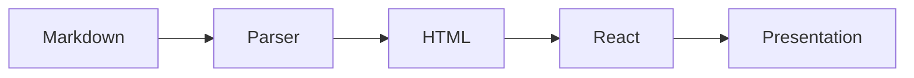

particles: true
---

# slides

A developer-first presentation framework

**Write Markdown. Present from the terminal.**

```bash
slides serve deck.md
```

---

## Why **slides**?

- Write presentations in **Markdown** -- version control friendly
- Serve from the **terminal** -- no GUI needed
- **Hot reload** -- edit your .md file and see changes instantly
- **Multiple themes** -- default, dark, and retro (8-bit!)
- **Agent-friendly** -- LLMs can generate slide decks natively
- **Timer built in** -- track how long you've been presenting

---

## Incremental **Reveal**

Add pause comments between content to reveal step by step:

- First, this point appears

<!-- pause -->

- Then this one shows up on click

<!-- pause -->

- And finally this one!

<!-- This is a speaker note for the incremental reveal slide -->

---

## Line **Highlighting**

Highlight specific lines with `{line-numbers}`:

```python {2,4-6}
def fibonacci(n: int) -> int:
    """Calculate the nth Fibonacci number."""
    if n <= 1:
        return n
    a, b = 0, 1
    for _ in range(2, n + 1):
        a, b = b, a + b
    return b
```

Lines 2 and 4-6 are highlighted above!

---

## **Mermaid** Diagrams

Draw diagrams with mermaid syntax:


```mermaid
graph LR
    A[Markdown] --> B[Parser]
    B --> C[HTML]
    C --> D[React]
    D --> E[Presentation]
```

---

## Markdown Syntax

Separate slides with `---` dividers:

```markdown
# First Slide

Content here

---

# Second Slide

More content
```

Add per-slide frontmatter for layouts:

```markdown
---
layout: center
---
```

---

## Code **Highlighting**

Full syntax highlighting powered by highlight.js:

```typescript {1,5-7}
interface Slide {
  content: string;
  frontmatter: Record<string, string>;
  notes?: string;
  steps?: string[];     // incremental reveal
  totalSteps: number;   // pause count + 1
}
```

---

## Keyboard **Shortcuts**

| Key | Action |
|-----|--------|
| `Right` / `Space` / `l` | Next slide / step |
| `Left` / `Backspace` / `h` | Previous slide / step |
| `g` / `G` | First / last slide |
| `f` | Toggle fullscreen |
| `o` | Toggle overview |
| `t` | Toggle timer |
| `d` | Cycle themes |
| `?` | Toggle help |

---

## Speaker Notes

Add notes with HTML comments -- they appear as a subtle indicator:

```markdown
# My Slide

Content visible to audience

<!-- Remember to mention the demo here -->
```

Notes are visible when you hover over the "notes" indicator.

<!-- This is a speaker note! Only the presenter sees this. -->

---

## AI **Generation**

Generate entire presentations from a topic:

```bash
export ANTHROPIC_API_KEY=your-key
slides generate "Introduction to WebAssembly"
```

<!-- pause -->

The AI knows about all slides features:
- Incremental reveals, mermaid diagrams
- Code highlighting, speaker notes
- Themes and layouts

---
bg: northlights
---

## 8-Bit Backgrounds

Use `bg` in frontmatter to set animated pixel art backgrounds:

`castle` / `northlights` / `dawn` / `cherryblossom` / `falls` / `nature` / `bridge_raining` / `et` / `watchdogs` / `pixelphony_2`

---
bg: castle
---

## Any Image Works

Set `bg` to a named 8-bit scene, an image path, or a CSS color:

```markdown
bg: castle
bg: /img/custom.jpg
bg: linear-gradient(135deg, #667eea, #764ba2)
```

---

## **Smart** Highlighting

Bold text in headings automatically gets the **accent color**:

```markdown
## From **Crashes** to **Confidence**
```

Draws attention to the key words in your title. Works with all themes.

---
particles: true
---

## **Floating** Particles

Add `particles: true` to slide frontmatter for animated background particles:

```markdown
---
particles: true
---
```

Subtle, colorful dots that float upward behind your content.

---

## **Live** Mode

Present with a live audience:

```bash
slides serve deck.md --live --tunnel
```

<!-- pause -->

- Audience follows your slides in real-time
- Emoji reactions float across the screen
- Cloudflare tunnel for public access

---

## Ready to Present?

```bash
# Create a new deck
slides new my-talk.md

# Start presenting
slides serve my-talk.md

# Present with live audience
slides serve my-talk.md --live
```

Press `d` to try different themes!

---

## Executable **Code** -- `{exec}`

Run JavaScript live in your slides, like a REPL:

```js {exec}
data = [
  { lang: "JavaScript", mass: 17.4 },
  { lang: "Python",     mass: 14.1 },
  { lang: "TypeScript", mass: 11.8 },
  { lang: "Java",       mass:  8.3 },
  { lang: "Rust",       mass:  4.7 },
]
max = Math.max(...data.map(d => d.mass))
data.forEach(d => {
  const bar = "█".repeat(Math.round(d.mass / max * 24))
  console.log(`${d.lang.padEnd(12)} ${bar} ${d.mass}%`)
})
```

<!-- pause -->

State flows between `{exec}` blocks -- `data` is still here:

```js {exec}
total = data.reduce((s, d) => s + d.mass, 0)
console.log(`Top ${data.length} languages = ${total.toFixed(1)}% of all repos`)
console.log(`#1 is ${data[0].lang} at ${data[0].mass}%`)
```

---

## Live **HTML** -- `{live}`

Render interactive HTML/CSS/JS directly in the slide:

```html {live}
<style>
  .demo-card {
    background: linear-gradient(135deg, #667eea 0%, #764ba2 100%);
    border-radius: 12px; padding: 1.5rem 2rem; color: white;
    font-family: system-ui; display: flex; align-items: center; gap: 1.5rem;
    box-shadow: 0 8px 30px rgba(102,126,234,0.4);
    animation: pulse 2s ease-in-out infinite alternate;
  }
  .demo-card .emoji { font-size: 2.5rem; }
  .demo-card h3 { margin: 0 0 0.3rem; font-size: 1.3rem; }
  .demo-card p { margin: 0; opacity: 0.85; font-size: 0.95rem; }
  @keyframes pulse {
    from { transform: scale(1); box-shadow: 0 8px 30px rgba(102,126,234,0.4); }
    to   { transform: scale(1.02); box-shadow: 0 12px 40px rgba(118,75,162,0.5); }
  }
</style>
<div class="demo-card">
  <span class="emoji">⚡</span>
  <div>
    <h3>No iframes. No sandboxes.</h3>
    <p>HTML, CSS, and JS run directly in the slide DOM.</p>
  </div>
</div>
```

---

## Interactive **Widgets** with `{live}`

```html {live}
<style>
  .color-lab { display: flex; gap: 2rem; align-items: center; font-family: 'Fira Code', monospace; }
  .color-lab input[type=range] { width: 180px; accent-color: var(--slide-accent); }
  .color-swatch {
    width: 100px; height: 100px; border-radius: 12px;
    border: 2px solid var(--slide-border);
    transition: background 0.15s;
    box-shadow: 0 4px 20px rgba(0,0,0,0.2);
  }
  .color-lab label { display: flex; align-items: center; gap: 0.5rem; font-size: 0.9rem; color: var(--slide-text); }
  .color-lab .sliders { display: flex; flex-direction: column; gap: 0.6rem; }
</style>
<div class="color-lab">
  <div class="sliders">
    <label>H <input type="range" min="0" max="360" value="260" oninput="
      this.closest('.color-lab').querySelector('.color-swatch').style.background =
        'hsl('+this.value+','+this.closest('.color-lab').querySelector('[data-s]').value+'%,'+this.closest('.color-lab').querySelector('[data-l]').value+'%)'
    "></label>
    <label>S <input type="range" data-s min="0" max="100" value="70" oninput="
      this.closest('.color-lab').querySelector('.color-swatch').style.background =
        'hsl('+this.closest('.color-lab').querySelector('input').value+','+this.value+'%,'+this.closest('.color-lab').querySelector('[data-l]').value+'%)'
    "></label>
    <label>L <input type="range" data-l min="0" max="100" value="55" oninput="
      this.closest('.color-lab').querySelector('.color-swatch').style.background =
        'hsl('+this.closest('.color-lab').querySelector('input').value+','+this.closest('.color-lab').querySelector('[data-s]').value+'%,'+this.value+'%)'
    "></label>
  </div>
  <div class="color-swatch" style="background: hsl(260,70%,55%)"></div>
</div>
```

Build interactive demos your audience can play with!

---

## **Algorithm** Walkthrough

Show how code actually runs -- step by step with `{exec}`:

```js {exec}
// FizzBuzz as a one-liner, broken down
result = Array.from({length: 20}, (_, i) => {
  n = i + 1
  return n % 15 === 0 ? "FizzBuzz"
       : n % 3  === 0 ? "Fizz"
       : n % 5  === 0 ? "Buzz"
       : String(n)
})
console.log(result.join(" · "))
```

<!-- pause -->

```js {exec}
// Count each category
fizz = result.filter(x => x === "Fizz").length
buzz = result.filter(x => x === "Buzz").length
both = result.filter(x => x === "FizzBuzz").length
nums = result.filter(x => !isNaN(+x)).length
console.log(`Fizz: ${fizz}  Buzz: ${buzz}  FizzBuzz: ${both}  Numbers: ${nums}`)
console.log(`Total: ${fizz + buzz + both + nums}`)
```

---

## Animated **{exec}** -- Live Counter

`{exec}` blocks receive an `output` element for async updates:

```js {exec}
let count = 0
const el = document.createElement('div')
el.style.fontSize = '2rem'
el.style.fontFamily = 'Fira Code, monospace'
output.appendChild(el)

setInterval(() => {
  count++
  el.textContent = `Counter: ${count}`
}, 1000)
```

Navigate away and back -- the counter restarts cleanly (auto-cleanup).

---

## Animated **{live}** -- Clock

`{live}` blocks also get automatic timer cleanup:

```html {live}
<div class="live-clock-widget" style="font-size: 2.5rem; font-family: 'Fira Code', monospace; text-align: center; padding: 1rem; color: var(--slide-accent);">
  --:--:--
</div>
<script>
  (function() {
    var el = document.querySelector('.live-clock-widget');
    if (!el) return;
    function tick() { el.textContent = new Date().toLocaleTimeString(); }
    tick();
    setInterval(tick, 1000);
  })();
</script>
```

Timers are cleaned up automatically when you leave this slide.

---
confetti: true
---

# Thanks!

Built for developers who present.

**slides v0.1.0**
